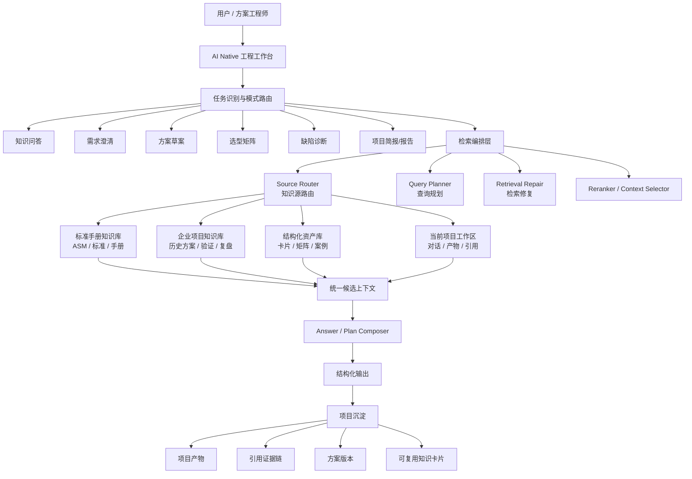

# 多知识源与企业项目知识库架构设计

> 状态：设计草案  
> 日期：2026-07-12  
> 目标：把当前 ASM 手册知识库逐步升级为“标准手册 + 企业历史项目 + 当前项目沉淀 + 结构化知识资产”的多源工程知识平台。

## 1. 设计背景

当前系统的知识基础主要来自 `ASM Handbook Vol.2`。它适合回答材料、性能、热处理、铸造/加工工艺等标准手册类问题，优势是依据明确、页码可追溯。

但解决方案工程师真实工作时，不只需要标准手册依据，还会依赖企业内部经验：

- 历史项目方案书。
- 客户需求与沟通记录。
- 选型矩阵和决策记录。
- 试验报告、验证报告、失效分析报告。
- 工艺变更记录和现场问题复盘。
- 工程师会议纪要与客户反馈。
- 最终交付报告。

因此后续系统不应把所有文档直接塞进一个无差别知识库，而应设计为多知识源、多权限、多检索策略的工程知识架构。

## 2. 总体目标

产品目标不是简单扩充文档数量，而是形成四层知识体系：

```text
标准手册知识库
  -> 提供权威基础依据

企业项目知识库
  -> 提供历史项目经验和内部工程判断

结构化资产库
  -> 沉淀材料卡片、工艺卡片、缺陷案例、证据卡片、选型矩阵

当前项目工作区
  -> 承载当前客户项目的对话、需求、产物、引用、方案版本
```

检索和回答时必须区分来源，不能把“手册依据”和“历史经验”混为同一种确定性结论。

## 3. 知识源分层

### 3.1 标准手册知识库

代表数据：

- ASM Handbook。
- 行业标准。
- 材料手册。
- 公开技术资料。

特点：

- 权威性高。
- 可作为正式引用依据。
- 内容相对稳定。
- 通常按页码、章节、材料、性能、工艺组织。

主要用途：

- 材料性能问答。
- 热处理制度查询。
- 铸造/加工工艺依据。
- 方案报告中的标准依据。

回答呈现时应标记为：

```text
来源类型：标准/手册依据
```

### 3.2 企业项目知识库

代表数据：

- 历史项目方案。
- 客户需求文档。
- 工程选型记录。
- 实验和验证报告。
- 现场问题复盘。
- 失败案例和经验教训。
- 交付文档。

特点：

- 企业私有。
- 与客户、项目、行业场景强相关。
- 可能包含不完整信息和主观判断。
- 需要权限隔离和脱敏。

主要用途：

- 查找相似项目。
- 复用历史方案。
- 识别以前踩过的坑。
- 支持销售/售前快速形成方案方向。
- 为新项目提供经验参考。

回答呈现时应标记为：

```text
来源类型：企业历史项目经验
```

### 3.3 结构化资产库

代表数据：

- 材料知识卡片。
- 工艺卡片。
- 缺陷案例卡片。
- 证据卡片。
- 选型矩阵。
- 风险模板。
- 验证计划模板。

特点：

- 来自标准手册、历史项目和当前项目沉淀。
- 比原始文档更适合复用。
- 需要结构化字段。

主要用途：

- 快速生成方案草案。
- 生成选型矩阵。
- 项目报告自动组装。
- 企业知识复用。

### 3.4 当前项目工作区

当前已实现的项目空间属于这一层。

代表数据：

- 当前项目基础信息。
- 项目内对话。
- 需求澄清产物。
- 知识问答依据。
- 方案草案。
- 选型矩阵。
- 缺陷诊断。
- 项目简报。
- 项目内引用证据。

特点：

- 面向当前客户项目。
- 生命周期短于企业知识库。
- 产物成熟后可沉淀为企业项目知识或结构化资产。

## 4. 技术架构

### 4.1 逻辑架构



### 4.2 核心原则

1. **来源分层，不混淆可信度**
   - ASM/标准是权威依据。
   - 历史项目是经验依据。
   - 当前项目产物是过程依据。

2. **检索路由先于检索执行**
   - 先判断问题应该查哪些知识源。
   - 不同任务模式使用不同 source scope。

3. **回答必须显式标注来源类型**
   - 标准手册依据。
   - 企业历史项目经验。
   - 当前项目推理。
   - 证据不足/待确认。

4. **项目空间是沉淀入口，不是最终知识库**
   - 当前项目产物成熟后，才可提升为企业知识资产。

5. **权限和租户隔离从第一天设计**
   - 企业项目知识不能和公共手册一样无差别检索。

## 5. 数据模型建议

### 5.1 knowledge_sources

用于管理不同知识源。

```sql
CREATE TABLE knowledge_sources (
  id SERIAL PRIMARY KEY,
  name TEXT NOT NULL,
  source_type TEXT NOT NULL,
  owner_user_id INTEGER,
  organization_id INTEGER,
  visibility TEXT NOT NULL DEFAULT 'private',
  description TEXT DEFAULT '',
  created_at TIMESTAMP DEFAULT NOW(),
  updated_at TIMESTAMP DEFAULT NOW()
);
```

`source_type` 建议值：

| 值 | 含义 |
| --- | --- |
| `standard_manual` | ASM、标准、公开手册 |
| `enterprise_project` | 企业历史项目文档 |
| `case_library` | 案例库 |
| `structured_asset` | 结构化知识卡片 |
| `current_project` | 当前项目工作区沉淀 |

### 5.2 document_sources

用于保存导入文档的元数据。

```sql
CREATE TABLE document_sources (
  id SERIAL PRIMARY KEY,
  knowledge_source_id INTEGER REFERENCES knowledge_sources(id),
  source_type TEXT NOT NULL DEFAULT 'standard_manual',
  title TEXT NOT NULL,
  file_name TEXT,
  file_type TEXT,
  source_uri TEXT,
  project_id INTEGER,
  customer_name TEXT,
  domain_tags JSONB DEFAULT '[]',
  confidentiality TEXT DEFAULT 'internal',
  status TEXT DEFAULT 'indexed',
  metadata JSONB DEFAULT '{}',
  created_at TIMESTAMP DEFAULT NOW(),
  updated_at TIMESTAMP DEFAULT NOW()
);
```

说明：

- 早期系统已经使用 `document_sources` 作为文档源表名，因此后续继续沿用该表名。
- 原设计中的 `source_documents` 作为概念名称保留，但实现上不再新建同义表，避免迁移和检索 join 复杂化。

### 5.3 chunks 扩展字段

当前已有文档 chunk 和向量检索能力，后续建议为 chunk 增加来源维度。

建议字段：

```sql
source_id INTEGER
document_id INTEGER
source_type TEXT
project_id INTEGER
customer_name TEXT
domain_tags JSONB
confidentiality TEXT
evidence_level TEXT
```

当前已落地：

- `chunks.source_type` 已补齐，现有 ASM chunk 统一为 `standard_manual`。
- `chunks.document_id` 已回填为当前 `source_id`，用于兼容后续文档表语义。
- `document_sources.source_type` 已补齐，现有 25 个 ASM 文档源统一为 `standard_manual`。
- 已创建默认 `knowledge_sources` 记录：`ASM Handbook Vol.2 / standard_manual / public`。

`evidence_level` 示例：

| 值 | 含义 |
| --- | --- |
| `standard` | 标准/手册依据 |
| `validated_project` | 已验证历史项目经验 |
| `project_note` | 当前项目过程记录 |
| `engineer_note` | 工程师备注 |
| `unverified` | 未验证资料 |

### 5.4 evidence_cards

用于把引用片段沉淀成证据卡片。

```sql
CREATE TABLE evidence_cards (
  id SERIAL PRIMARY KEY,
  user_id INTEGER NOT NULL,
  project_id INTEGER,
  source_id INTEGER,
  document_id INTEGER,
  artifact_id INTEGER,
  title TEXT NOT NULL,
  evidence_type TEXT NOT NULL DEFAULT 'general',
  page INTEGER,
  section TEXT,
  quote TEXT NOT NULL,
  summary TEXT DEFAULT '',
  tags JSONB DEFAULT '[]',
  reliability TEXT DEFAULT 'medium',
  created_at TIMESTAMP DEFAULT NOW(),
  updated_at TIMESTAMP DEFAULT NOW()
);
```

`evidence_type` 建议值：

- `material`
- `process`
- `mechanical_property`
- `heat_treatment`
- `corrosion`
- `defect`
- `standard`
- `cost`
- `validation`

## 6. 检索路由策略

### 6.1 按任务模式选择知识源

| 任务模式 | 默认知识源 |
| --- | --- |
| 知识问答 | 标准手册知识库 |
| 需求澄清 | 当前项目 + 历史项目 + 标准手册 |
| 方案草案 | 当前项目 + 标准手册 + 历史项目 |
| 选型矩阵 | 标准手册 + 历史项目 + 结构化资产 |
| 缺陷诊断 | 缺陷案例库 + 历史项目 + 标准手册 |
| 项目简报 | 当前项目工作区 |
| 项目报告 | 当前项目 + 证据卡片 + 标准手册 + 历史项目 |

### 6.2 Source Router 输出结构

```json
{
  "task_mode": "solution_draft",
  "source_scope": [
    {
      "source_type": "standard_manual",
      "priority": 1,
      "reason": "需要权威材料与工艺依据"
    },
    {
      "source_type": "enterprise_project",
      "priority": 2,
      "reason": "需要参考相似历史项目经验"
    },
    {
      "source_type": "current_project",
      "priority": 3,
      "reason": "需要结合当前客户需求和已保存产物"
    }
  ],
  "must_separate_sources": true
}
```

### 6.3 回答组织要求

当同时使用多类知识源时，回答应分层呈现：

```text
一、标准/手册依据
...

二、企业历史项目经验
...

三、结合当前项目的判断
...

四、证据不足与待确认项
...
```

不允许把历史项目经验写成标准结论。

## 7. 文档导入与索引流程

### 7.1 标准手册导入流程

```text
上传/放置 PDF
-> 文档解析
-> 页码与章节识别
-> chunk 切分
-> metadata 标注 source_type=standard_manual
-> embedding
-> tsvector/BM25
-> 索引完成
```

### 7.2 企业项目文档导入流程

```text
上传项目文档
-> 选择所属客户/项目/知识源
-> 脱敏检查
-> 文档解析
-> 自动识别文档类型
-> 提取项目字段
-> chunk 切分
-> metadata 标注 source_type=enterprise_project
-> embedding + 全文索引
-> 生成可选结构化资产
```

项目文档导入时需要额外提取：

- 客户行业。
- 工况条件。
- 材料/工艺候选。
- 最终推荐方案。
- 验证结果。
- 风险与问题。
- 项目结果。

## 8. 权限与安全

至少需要支持三层可见性：

| visibility | 含义 |
| --- | --- |
| `public` | 系统公共知识，例如公开手册 |
| `organization` | 企业内部共享知识 |
| `private` | 用户个人或项目私有知识 |

检索时必须带权限过滤：

```text
WHERE visibility = 'public'
   OR organization_id = current_user.organization_id
   OR owner_user_id = current_user.id
```

后续如果进入企业化，需要进一步支持：

- 客户项目隔离。
- 部门隔离。
- 文档密级。
- 下载权限。
- 引用脱敏。
- 审计日志。

## 9. 前端产品形态

### 9.1 知识源管理页

用于管理：

- ASM 手册库。
- 企业项目库。
- 缺陷案例库。
- 结构化资产库。

第一版可以先不做完整后台，只在项目空间里预留入口。

### 9.2 项目证据库

下一步最适合落地的功能。

在项目详情面板中新增“引用依据”分区：

- 聚合当前项目所有产物的 citations。
- 自动去重。
- 显示页码、章节、片段、来源产物。
- 点击跳转 PDF。
- 支持关键词搜索。
- 支持标签分类：材料、工艺、性能、腐蚀、热处理、缺陷、标准/规范。

后续升级为 evidence_cards，可手动收藏、备注、确认是否可用于报告。

### 9.3 知识来源选择器

在工作台输入区或任务模式旁增加来源选择：

```text
[x] 标准手册
[ ] 历史项目
[ ] 当前项目
[ ] 结构化资产
```

默认由系统根据任务自动选择，工程师可手动覆盖。

## 10. 分阶段落地计划

### Phase 1：项目证据库 V1

不新增后端表，先从 `project_artifacts.citations` 派生。

实现内容：

- 项目面板新增“引用依据”分区。
- 聚合项目内所有 citations。
- 去重。
- 搜索。
- 标签分类。
- 跳转 PDF。

价值：

- 立刻改善项目内依据组织。
- 为后续 evidence_cards 和项目报告打基础。

### Phase 2：Evidence Cards

新增 `evidence_cards` 表。

实现内容：

- 从引用一键保存证据卡片。
- 支持备注、标签、可靠性。
- 支持证据卡片进入项目简报/报告。

当前状态：

- 已完成第一版持久化。
- 项目面板可把自动引用保存为证据卡。
- 已保存证据支持备注、可靠性、是否可用于报告。
- 后续需要让项目简报/报告生成链路优先读取 `usable_in_report = TRUE` 的证据卡。

### Phase 3：知识源管理与文档导入

新增：

- `knowledge_sources`
- `document_sources`
- chunk metadata 扩展

实现内容：

- 管理不同知识源。
- 导入历史项目文档。
- 索引时写入 source_type/source_id/project_id。

### Phase 4：多源检索路由

实现 Source Router。

内容：

- 根据任务模式和用户问题判断检索哪些知识源。
- 回答中分层展示标准依据、历史经验、当前项目判断。
- 检索日志中展示每类来源命中情况。

### Phase 5：企业知识沉淀

实现：

- 项目产物沉淀为企业案例。
- 方案草案沉淀为方案模板。
- 缺陷诊断沉淀为缺陷案例。
- 材料/工艺卡片自动更新。

## 11. 当前建议

短期不建议马上做完整“历史项目知识库导入”，因为这会牵涉文档解析、权限、source metadata、检索路由和 UI 管理。

更稳的下一步是：

```text
先做项目证据库 V1
```

原因：

- 不新增表也能做。
- 直接复用当前 `project_artifacts.citations`。
- 能马上改善项目工作台价值。
- 是后续 Evidence Cards、历史项目知识库、项目报告的地基。

## 12. 待评估问题

正式开发多知识源前，需要确认：

1. 企业历史项目文档是否有样例。
2. 文档格式主要是 PDF、Word、Markdown，还是混合。
3. 是否需要客户/项目级权限隔离。
4. 是否需要脱敏能力。
5. 历史项目文档是否允许被普通问答检索到。
6. 回答中是否必须强制区分“标准依据”和“经验依据”。
7. 后续是否要支持用户上传文档。
8. 是否优先支持“当前项目沉淀为企业案例”。
## 当前落地：项目工程文档导入 V1

为避免一上来就把企业项目资料直接混入全局 RAG，当前采用更稳的中间层设计：

```text
项目空间
-> 导入工程文档
-> 保存原文件到对象存储契约
-> 抽取 docx/txt/md 文本
-> 生成 project_artifacts.engineering_case
-> 由工程师在项目内继续确认、整理、沉淀证据
-> 后续再选择是否进入企业知识库索引
```

当前实现选择：
- 存储：`storage_backend = local`，字段结构兼容未来 MinIO/S3。
- 范围：只进入当前项目，不默认进入全局检索。
- 解析：Word 使用 OOXML 确定性解析，保留标题、段落、列表、表格和图片引用；图片/脑图先保存原件，后续接 OCR 或人工结构化。
- 产物：每次导入都会生成一个 `engineering_case` 项目产物，进入项目详情面板的“五类产物/工程案例”分区。

后续升级路径：
1. 把 `LocalObjectStore` 替换为 `MinioObjectStore`。
2. 增加 OCR/版面解析，把图片脑图转成结构化过程树。
3. 增加脱敏检测，通过后才允许进入 `enterprise_project` 知识源。
4. 为确认后的工程案例生成 chunks，并写入 `source_type = enterprise_project`。
