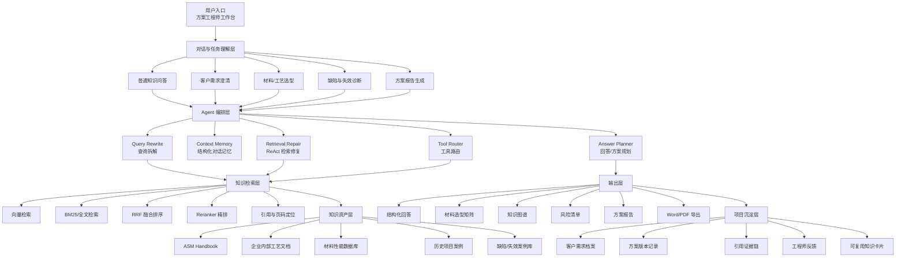
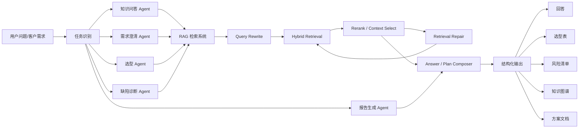

# 2026-07-11 项目进展与优化记录

## 当前阶段

项目已经完成从基础知识库问答到交互式检索工作台的初步演进，当前重点从“功能能跑通”转向“检索质量、可解释性、稳定性和调试效率”。

近期主要围绕以下方向迭代：

- Vue 前端工作台基本可用，支持对话、历史记录、引用来源、知识图谱展示。
- 后端 RAG 流程已具备查询拆解、混合检索、上下文精选、回答生成、引用返回。
- 多轮上下文污染问题已开始修复，显式实体优先级高于历史上下文。
- 多实体比较查询已从 LLM 自由改写收敛为确定性 per-entity 查询，避免遗漏实体。
- 已加入第一版检索修复链路，在回答判断为“知识库未找到”时，先尝试重新规划检索，而不是直接进入大模型兜底。

## 原有功能优化清单

### 1. ReAct 式检索修复

目标：把“未命中就兜底”的单跳流程升级为可分析、可重试、可解释的检索修复流程。

现状：

- 后端已有 `rewrite -> search -> select_ctx -> generate -> check` 主流程。
- 已新增 `repair` 节点雏形。
- 当回答包含“知识库中没有找到相关信息”等失败信号时，会进入检索修复。
- 检索修复会分析上一轮 query、top hits、selected context 和失败回答，生成新的英文检索 query。
- LLM 规划失败时，有规则兜底查询，例如 `properties and selection`、`high alloy iron castings properties`。

后续优化：

- 将失败类型结构化为 `no_candidates`、`weak_context`、`model_refused`、`entity_missing`。
- 对每种失败类型使用不同修复策略。
- 将 repair 的原因、上一轮 query、新 query、命中变化写入返回结果。
- 在前端日志中展示“为什么重新检索”。
- 支持最多 2-3 轮修复，超过次数后再 fallback。

### 2. 检索诊断与可解释面板

目标：让用户和开发者能看到每一轮检索为什么这样做、命中了什么、为什么被选入上下文。

建议展示内容：

- 原始问题。
- 上下文解析后的问题。
- core entity。
- filter rule。
- search queries。
- 每条 query 的 top hits。
- 候选数量和精选数量。
- reranker 是否启用。
- reranker 跳过原因。
- repair 是否触发。
- repair 原因和新 query。

价值：

- 方便判断是 query 拆解问题、召回问题、rerank 问题，还是回答生成阶段拒答。
- 减少“前端看起来没查到，但后端其实有候选”的调试成本。
- 为后续用户反馈和检索质量评估打基础。

### 3. Reranker 策略优化

现状：

- 后端已接入 `sentence_transformers.CrossEncoder` reranker。
- 单实体查询会使用 reranker 精排上下文。
- 多实体比较查询目前跳过 reranker，以避免第一实体吞掉其他实体。

后续优化：

- 多实体比较不要完全跳过 reranker，而是改成“分实体 rerank + 配额融合”。
- 每个实体保留固定上下文配额，例如每个实体至少 2 条。
- 对同一实体内部使用 reranker 精排。
- 最终再做去重和多样性控制。

### 4. 知识图谱增强

现状：

- 回答中可以生成知识图谱。
- 图谱已能展示核心节点和部分引用来源。

后续优化：

- 从回答和引用中抽取结构化三元组：材料、性能、数值、单位、工况、来源页码。
- 支持多材料比较图谱。
- 节点点击后联动引用卡片和 PDF 页面。
- 图谱结果保存到历史会话。
- 允许用户从图谱节点继续追问。

### 5. 结构化对话记忆

目标：减少“它的硬度呢”“他的颜色呢”“那和铝合金比呢”这类追问中的实体漂移。

建议维护 conversation memory：

- 当前主题实体。
- 当前比较对象。
- 当前关注属性。
- 最近成功检索 query。
- 最近失败检索 query。
- 用户纠正过的上下文。

原则：

- 当前问题中出现显式实体时，必须优先使用当前实体。
- 历史上下文只用于补全代词或省略主语。
- 不允许旧问题中的 6061、铝合金等实体污染新问题。

### 6. 引用和 PDF 查看器优化

现状：

- 引用卡片可展示页码、score、片段。
- PDF 查看能力已恢复。

后续优化：

- 引用卡片展示更明确的字段：章节、页码、命中 query、命中原因。
- PDF 打开后高亮对应文本片段。
- 支持“查看上下文片段”。
- 支持用户标记“不相关引用”，用于后续优化 rerank 和过滤规则。

### 7. 回答生成 Prompt 优化

问题：

- 当前 prompt 对“必须严格依据检索结果”约束较强。
- 当检索结果不是直接三方对比表，而是分散在不同章节时，模型可能过早判断“未找到”。

优化方向：

- 明确允许“基于多个分散来源做部分比较”。
- 当只有部分维度有证据时，输出“可比较维度”和“缺失维度”。
- 避免一看到没有完整表格就回复未找到。
- fallback 前必须先经过 repair。

## 建议优先级

1. 检索诊断面板：先让问题可见。
2. ReAct 检索修复强化：让系统能自我纠错。
3. 多实体 rerank 配额融合：提升比较类问题稳定性。
4. 结构化对话记忆：提升多轮追问体验。
5. 知识图谱结构化抽取：增强 AI Native 体验。
6. 引用与 PDF 联动：提升可信度和可检查性。

## 下一步建议

下一步建议优先实现“检索诊断面板 + repair_history 前端展示”。

原因：

- 后端已经开始返回 retrieval 信息。
- repair 节点也已经能记录修复原因和新 query。
- 把这些内容展示出来后，后续所有检索质量问题都能更快定位。
- 这属于原有功能增强，不会大幅改变产品方向。

## 产品展望：材料铸造行业解决方案工程师工作台

### 产品定位

产品不应只定位为“材料知识库聊天机器人”，而应升级为：

**面向材料铸造行业解决方案工程师的 AI Native 方案工作台。**

核心价值不是回答一句材料问题，而是帮助工程师完成从客户需求、材料选型、工艺判断、风险分析、依据引用，到最终方案草案的完整工作流。

目标用户包括：

- 售前解决方案工程师。
- 材料工程师。
- 铸造工艺工程师。
- 技术支持工程师。
- 项目型销售工程师。
- 企业内部知识库管理员。

这些用户的核心诉求：

- 快速形成可信方案。
- 减少翻手册和查资料时间。
- 避免材料、热处理、铸造工艺选错。
- 能引用可靠依据。
- 能沉淀项目经验。
- 能把对话成果转化为可交付文档。

### 产品能力升级方向

当前系统已经具备知识问答与检索能力，未来应升级为：

```text
需求澄清 + 知识检索 + 方案推理 + 风险分析 + 报告生成 + 项目沉淀
```

### 功能架构图



### Agent 能力架构



### 新功能方向

#### 1. 客户需求澄清器

输入客户原始需求，系统自动输出：

- 已知条件。
- 缺失条件。
- 关键风险。
- 必须追问客户的问题。
- 推荐追问顺序。
- 初步材料与工艺方向。

适用场景：

- 客户需求模糊。
- 售前需要快速判断下一步沟通重点。
- 工程师需要避免遗漏关键工况条件。

#### 2. 材料/工艺选型助手

输入工况约束：

- 介质。
- 温度。
- 压力。
- 载荷。
- 腐蚀环境。
- 成本等级。
- 批量。
- 是否需要热处理。
- 是否必须铸造。

系统输出候选矩阵：

| 候选材料 | 适用原因 | 风险 | 工艺建议 | 成本 | 证据 |
| --- | --- | --- | --- | --- | --- |

该功能将系统从“查资料”升级为“辅助决策”。

#### 3. 缺陷与失效诊断助手

面向现场问题，例如气孔、缩孔缩松、裂纹、夹渣、冷隔、偏析、变形、热处理异常。

输出内容：

- 可能原因排序。
- 排查步骤。
- 现场需要补充的信息。
- 工艺参数检查项。
- 改进建议。
- 相关知识库依据。

#### 4. 方案草案生成器

一次需求澄清或选型对话后，系统生成方案草案：

- 项目背景。
- 客户需求。
- 工况分析。
- 推荐材料。
- 推荐工艺。
- 风险分析。
- 替代方案。
- 引用依据。
- 待确认问题。
- 下一步行动建议。

后续可支持导出 Word/PDF。

#### 5. 项目工作区

从“历史对话”升级到“客户项目空间”。

每个项目包含：

- 客户信息。
- 需求记录。
- 对话记录。
- 候选材料。
- 方案版本。
- 引用证据。
- 知识图谱。
- 决策记录。
- 最终报告。

这会让产品更像工程师工作台，而不是聊天窗口。

#### 6. 材料知识卡片库

每次检索材料时，系统自动生成可复用材料卡片：

- 材料名称。
- 典型成分。
- 力学性能。
- 热处理制度。
- 铸造/加工适配。
- 应用场景。
- 优缺点。
- 注意事项。
- 来源引用。

长期积累后可形成企业内部结构化知识资产。

### 产品演进路线

#### 第一阶段：可信知识检索工作台

目标：

- 问答稳定。
- 引用可信。
- 上下文不乱。
- 检索可解释。
- ReAct 修复能用。

#### 第二阶段：方案工程师助手

新增：

- 需求澄清。
- 材料/工艺选型。
- 对比矩阵。
- 缺陷诊断。
- 方案草案。

#### 第三阶段：项目化工作台

新增：

- 项目空间。
- 方案版本。
- 客户需求档案。
- 报告导出。
- 团队协作。
- 企业知识沉淀。

#### 第四阶段：行业知识中台

新增：

- 企业内部标准。
- 历史项目案例。
- 缺陷案例库。
- 用户反馈训练。
- 结构化材料数据库。
- 工艺知识图谱。

### 建议的新功能开发起点

建议优先做：

```text
客户需求澄清器 + 方案草案生成器
```

原因：

- 最贴近材料铸造行业解决方案工程师的真实工作。
- 能明显区别于普通知识库聊天工具。
- 可以复用现有 RAG、历史对话、引用、知识图谱能力。
- 第一版不需要大改底层架构，只需要增加任务模式、Prompt、结构化输出和前端展示。

第一版页面可以增加模式切换：

```text
知识问答 / 需求澄清 / 方案草案
```

第一版输出结构：

- 需求澄清模式：已知条件、缺失条件、风险点、追问清单、初步推荐方向。
- 方案草案模式：需求摘要、候选材料、推荐工艺、风险分析、引用依据、待确认事项。

## 文档先行开发约定

从“解决方案工程师工作台”阶段开始，新增功能不再直接开写代码，而是先维护三类文档：

- 产品方向：`docs/product-spec.md` 或当日记录文档。
- 数据结构：`docs/data-structure.md`。
- 系统接口：`docs/system-interfaces.md`。

每次开发前需要先明确：

1. 新功能属于哪个任务模式。
2. 前端消息 metadata 如何保存。
3. 后端接口是否需要新增参数。
4. SSE 是否新增事件。
5. 结构化输出 schema 是什么。
6. 历史会话如何兼容旧数据。

本轮已新增：

- `docs/data-structure.md`
- `docs/system-interfaces.md`

后续开发“需求澄清器 + 方案草案生成器”时，应以这两份文档作为契约。

## 任务模式第一版实现

本轮已按“共用工作台壳层、分任务渲染器”的方案完成第一版：

- 前端顶栏增加模式切换：`知识问答 / 需求澄清 / 方案草案`。
- `GET /chat/stream` 增加 `mode` 参数，默认保持 `qa`，兼容原知识库问答。
- 后端 `agent_chat` 和 `stream_chat` 透传 `mode`。
- `qa` 模式继续使用原有 RAG 回答链路。
- `requirement_clarification` 和 `solution_draft` 模式要求 LLM 返回 `answer + structured_output`。
- 历史消息 metadata 保存 `mode` 和 `structured_output`，加载历史时可恢复对应展示。
- 前端新增结构化输出渲染器，用于展示已知条件、缺失条件、风险、候选材料、推荐路线、验证步骤等工程字段。

已验证：

- `python -m py_compile` 通过 `scripts/agent.py` 和 `scripts/gateway.py`。
- `npm.cmd run build` 通过 Vue 构建。
- Playwright 使用本机 Edge 打开本地页面，确认三种模式按钮可见且无控制台错误。
- 点击 `需求澄清` 和 `方案草案` 后，输入框提示语会按模式切换。

## 选型矩阵第一版

本轮继续补齐解决方案工程师工作台的大框架，新增第四个任务模式：

```text
selection_matrix / 选型矩阵
```

目标：

- 将候选材料、工艺路线、性能目标、风险和证据放入一张工程决策矩阵。
- 显式多候选问题按候选项分别检索，例如钛合金、铝合金、铁合金分别拆成独立英文检索语句。
- 工况型问题不把温度、预算、应用场景误识别为候选实体，而是作为评价约束参与检索。
- 前端提供独立模式入口、独立上下文、独立欢迎页和专用矩阵渲染。

已实现：

- 后端 `SUPPORTED_MODES` 增加 `selection_matrix`。
- 新增选型矩阵生成 Prompt 和检索规划 Prompt。
- 新增选型矩阵 fallback 结构。
- 前端模式切换增加 `选型矩阵`。
- `ChatInput`、`ChatArea` 增加选型矩阵文案和示例。
- `StructuredOutputRenderer` 增加专用矩阵表格渲染。
- `docs/data-structure.md` 和 `docs/system-interfaces.md` 更新选型矩阵 schema 与接口契约。

已验证：

- `python -m py_compile scripts/agent.py scripts/gateway.py` 通过。
- `npm.cmd run build` 通过。
- 函数级验证：多候选问题拆成全英文、候选独立的检索语句。
- 浏览器验证：四个模式按钮可见，切换到选型矩阵后欢迎页和输入提示正常，无控制台错误。

## 缺陷诊断第一版

新增第五个任务模式：

```text
defect_diagnosis / 缺陷诊断
```

目标：

- 面向铸造现场缺陷和材料失效问题，输出可执行的排查报告。
- 将用户描述拆成缺陷现象、可能原因、检查方法、工艺检查点、纠正措施和缺失现场信息。
- 与知识问答、需求澄清、方案草案、选型矩阵保持独立上下文。

已实现：

- 后端 `SUPPORTED_MODES` 增加 `defect_diagnosis`。
- 新增缺陷诊断生成 Prompt 和检索规划 Prompt。
- 新增缺陷类中英文检索词归一化：气孔、针孔、缩孔、缩松、热裂、裂纹、夹杂、冷隔、浇不足、硬度不足、失效等。
- 新增缺陷诊断 fallback 结构。
- 前端模式切换增加 `缺陷诊断`。
- `ChatInput`、`ChatArea` 增加缺陷诊断文案和示例。
- `StructuredOutputRenderer` 增加缺陷诊断报告展示：可能原因表、现场排查顺序、工艺检查点、纠正措施、待补充信息。
- `docs/data-structure.md` 和 `docs/system-interfaces.md` 更新缺陷诊断 schema 与接口契约。

已验证：

- 函数级验证：缺陷诊断检索语句全英文。
- 函数级验证：没有明确材料时不会把“热处理后”等工艺短语误识别为材料过滤实体。

## 项目空间第一版

本轮开始把系统从“只会问答的检索工具”推进到“可沉淀项目资产的工程工作台”。

目标：

- 让解决方案工程师可以围绕客户项目持续沉淀知识问答、需求澄清、方案草案、选型矩阵、缺陷诊断等产物。
- 不打断原有对话式工作流，在同一工作台内完成保存和回看。
- 为后续报告生成、项目复盘、案例库和方案模板打基础。

已实现：

- 后端新增 `projects` 表，按登录用户隔离项目空间。
- 后端新增 `project_artifacts` 表，保存回答正文、结构化数据、引用来源、检索解释和知识图谱等 metadata。
- 新增项目接口：
  - `GET /api/projects`
  - `POST /api/projects`
  - `GET /api/projects/{project_id}`
  - `POST /api/projects/{project_id}/artifacts`
- 前端新增 `project` store，统一维护项目列表、当前项目、项目产物保存。
- 侧栏新增“项目空间”分区，支持创建项目和打开项目面板。
- AI 回答卡片新增“保存到项目”操作；未选择项目时会自动创建一个以当前问题命名的项目。
- 新增右侧 `ProjectPanel`，展示项目信息、产物数量、产物列表和引用数量。
- `docs/data-structure.md` 和 `docs/system-interfaces.md` 更新为项目空间第一版的实际数据结构与接口契约。

后续增强：

- `conversations` 增加 `project_id` 字段。
- 当前端选中项目后，新建对话会自动绑定到该项目。
- 已有对话继续沿用原归属，不会因为切换项目而中途改绑。
- 项目详情返回该项目下的对话列表，项目面板可以直接恢复项目内历史对话。
- 关闭项目面板不会清空当前项目上下文，用户可以在不展开面板的情况下持续进行项目内问答。

项目交互修正：

- 项目列表增加 `conversation_count`，侧栏同时展示“对话数”和“产物数”，避免项目内新对话已保存但仍显示 `0 个产物` 造成误解。
- 新建项目改为侧栏内联输入名称，不再直接生成默认“新工程项目”。
- 项目名称支持双击重命名，前端调用 `PUT /api/projects/{project_id}` 保存。

## 项目详情工作台第一版

在项目空间基础上，右侧 `ProjectPanel` 从简单列表升级为项目详情工作台。

目标：

- 围绕一个客户项目，持续积累需求、依据、方案、比较、风险和报告。
- 把五个任务模式的输出从“聊天记录”组织为“工程项目产物”。
- 给解决方案工程师一个可回看、可归纳、可继续推进的项目视图。

已实现：

- 项目概览：自动展示当前阶段、候选材料 / 工艺数量、风险点数量、待确认问题数量。
- 自动归纳字段：
  - 候选材料 / 工艺：来自方案草案与选型矩阵。
  - 关键风险：来自方案风险与缺陷诊断。
  - 待确认问题：来自需求澄清、方案草案、选型矩阵、缺陷诊断。
  - 初步结论：来自方案草案推荐、需求澄清初步方向等字段。
- 项目简报预览：基于项目名称、阶段、对话数、产物数、引用数和自动归纳字段生成 Markdown 摘要。
- 项目内对话：保留点击恢复历史对话能力。
- 五类产物分区：
  - 需求澄清。
  - 知识依据。
  - 方案草案。
  - 选型矩阵。
  - 缺陷诊断。

说明：

- 本版不新增后端表。
- 项目概览由前端从 `project_artifacts.structured_data`、`citations` 和项目内 `conversations` 派生。
- 后续若需要跨设备缓存概览，可再增加 `project_summaries` 或 `project_snapshots` 表。

已验证：

- `python -m py_compile scripts/auth_handler.py scripts/gateway.py` 通过。
- `npm.cmd run build` 通过 Vue 构建。

## 项目简报生成器第一版

在项目详情工作台基础上，新增项目级简报生成链路。

目标：

- 将项目内对话、五类产物、结构化数据和引用依据聚合为一份工程简报。
- 让项目空间从“资料归档面板”进一步变成“交付物生成工具”。

已实现：

- 新增 `POST /api/projects/{project_id}/brief`。
- 后端聚合项目基础信息、项目内对话、项目产物、结构化数据和引用页码线索。
- 复用现有 DeepSeek/OpenAI 兼容 LLM 调用配置，通过 `_agent._call_llm` 生成 Markdown 简报。
- 生成结果保存为 `project_artifacts`，类型为 `project_brief`。
- 如果 LLM 调用失败，后端会用项目已有字段生成基础版 fallback 简报，避免前端无结果。
- 前端 ProjectPanel 增加“生成简报 / 重新生成”按钮。
- ProjectPanel 优先展示已保存的正式简报，没有正式简报时显示本地预览版。
- 产物分区新增“项目简报”分区。
